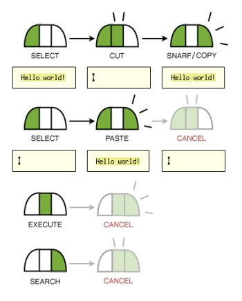

# Acme not Acne

<figcaption>Image by Tom Lieber</figcaption>

If you're coming from the world of Emacs or Vim, you're not going to be able to scratch that itch of configuring Acme to your hearts content. Theoretically, you can by editing it's source code but that's a topic for another day.

As repeated by many others, &ldquoThe killer feature of Acme is how it integrates into the surrounding system. Acme is not trying to be a complete environment by itself. Rather Acme acts as the glue linking together other programs and tools. With Acme the OS becomes your IDE&rdquo;

- Edit =
    - reveals current line number
https://github.com/evbogdanov/acme/blob/master/README.md
