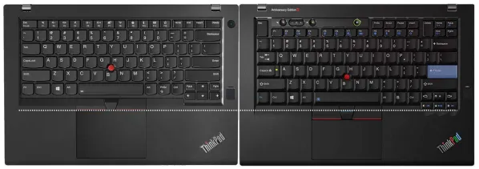

# Keyboards

I've lost `ctrl`, I want to `escape` just give me some `space`

I do not type, I dictate.

General  thoughts

Ask yourself this, which is better

I don't foresee any major laptop manufacturer, including Framework creating an ergonomic laptop keyboard, I dont think we should even be using laptops unless you absolutely have to

