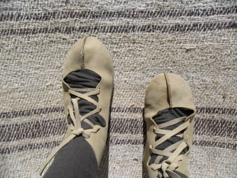
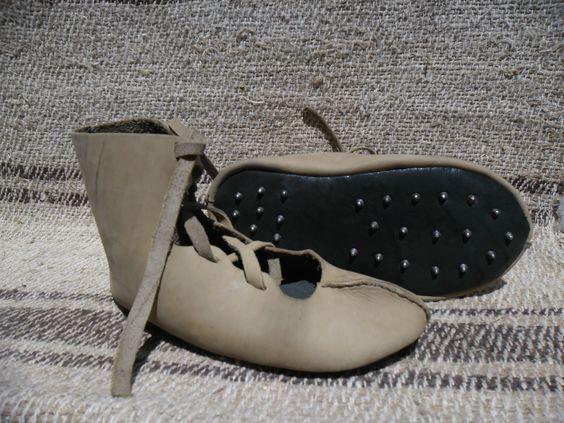
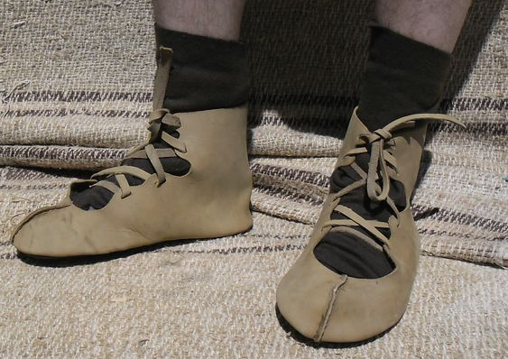
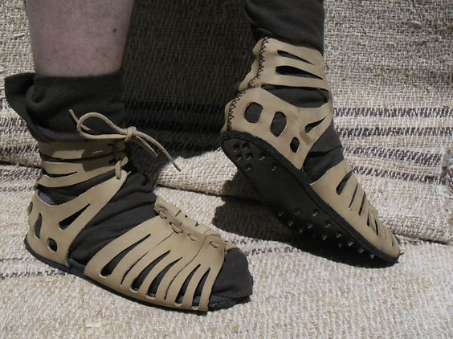
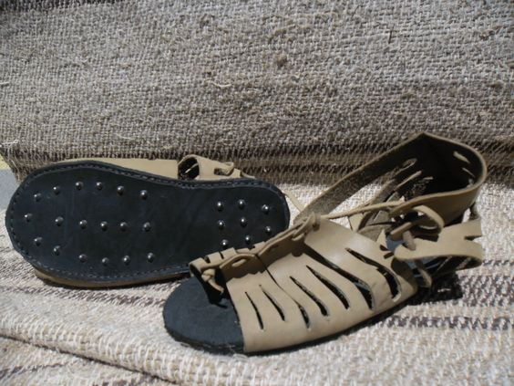

Archived from [medievalisticals.com](http://web.archive.org/web/20220122105909/https://medievalisticals.com/roman-caligae-and-roman-calcei/), which no longer exists

> This winter, Chigot received an order from the local museum of Pernik for a couple of full outfits. The outfits included two fully armed legionnaires from the second and the forth century. As a member of Chigot, I was asked to make some roman footwear and clothing. The shoes were the biggest challenge because roman footwear is a bit more complicated than medieval footwear. All roman caligae and calcei have very thick soles with hobnails. Until last month, I had never worked with hobnails. It wasn’t too hard, though. As you can see, the shoes turned out great, and I’m pretty proud of myself.

> Both pairs of shoes are made with a double sole. They have two layers of leather over a centimeter thick. The soles are glued, sewn, and nailed together with hobnails. These are by far the sturdiest soles I’ve made. Enjoy.

> Vasil

# Images

