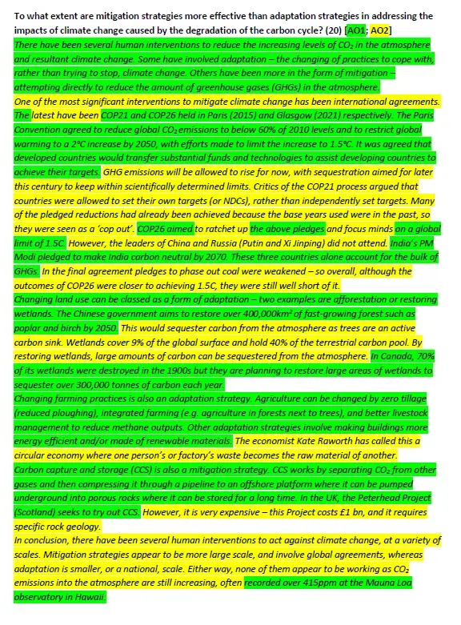

# AO1 v. AO2 Essays (2)

AO1 - in green; AO2 in yellow. (Please remember the parameters of 30 minutes to write, and circa 600 words as a maximum.)

[Over 60 new subscribers in the last 24 hours - welcome. The total is now approaching 600]

Title: To what extent are mitigation strategies more effective than adaptation strategies in addressing the impacts of climate change caused by the degradation of the carbon cycle? (20)

There have been several human interventions to reduce the increasing levels of CO2 in the atmosphere and resultant climate change. Some have involved adaptation – the changing of practices to cope with, rather than trying to stop, climate change. Others have been more in the form of mitigation – attempting directly to reduce the amount of greenhouse gases (GHGs) in the atmosphere.

One of the most significant interventions to mitigate climate change has been international agreements. The latest have been COP21 and COP26 held in Paris (2015) and Glasgow (2021) respectively. The Paris Convention agreed to reduce global CO2 emissions to below 60% of 2010 levels and to restrict global warming to a 2°C increase by 2050, with efforts made to limit the increase to 1.5°C. It was agreed that developed countries would transfer substantial funds and technologies to assist developing countries to achieve their targets. GHG emissions will be allowed to rise for now, with sequestration aimed for later this century to keep within scientifically determined limits. Critics of the COP21 process argued that countries were allowed to set their own targets (or NDCs), rather than independently set targets. Many of the pledged reductions had already been achieved because the base years used were in the past, so they were seen as a ‘cop out’. COP26 aimed to ratchet up the above pledges and focus minds on a global limit of 1.5C. However, the leaders of China and Russia (Xi Jinping and Putin) did not attend. India’s PM Modi pledged to make India carbon neutral by 2070. These three countries alone account for the bulk of GHGs. In the final agreement pledges to phase out coal were weakened – so overall, although the outcomes of COP26 were closer to achieving 1.5C, they were still well short of it.

Changing land use can be classed as a form of adaptation – two examples are afforestation or restoring wetlands. The Chinese government aims to restore over 400,000km2 of fast-growing forest such as poplar and birch by 2050. This would sequester carbon from the atmosphere as trees are an active carbon sink. Wetlands cover 9% of the global surface and hold 40% of the terrestrial carbon pool. By restoring wetlands, large amounts of carbon can be sequestered from the atmosphere. In Canada, 70% of its wetlands were destroyed in the 1900s but they are planning to restore large areas of wetlands to sequester over 300,000 tonnes of carbon each year.

Changing farming practices is also an adaptation strategy. Agriculture can be changed by zero tillage (reduced ploughing), integrated farming (e.g. agriculture in forests next to trees), and better livestock management to reduce methane outputs. Other adaptation strategies involve making buildings more energy efficient and/or made of renewable materials. The economist Kate Raworth has called this a circular economy where one person’s or factory’s waste becomes the raw material of another.

Carbon capture and storage (CCS) is also a mitigation strategy. CCS works by separating CO2 from other gases and then compressing it through a pipeline to an offshore platform where it can be pumped underground into porous rocks where it can be stored for a long time. In the UK, the Peterhead Project (Scotland) seeks to try out CCS. However, it is very expensive – this Project costs £1bn, and it requires specific rock geology.

In conclusion, there have been several human interventions to act against climate change, at a variety of scales. Mitigation strategies appear to be more large scale, and involve global agreements, whereas adaptation is smaller, or a national, scale. Either way, none of them appear to be working as CO2 emissions into the atmosphere are still increasing, often recorded over 415ppm at the Mauna Loa observatory in Hawaii. (616)

