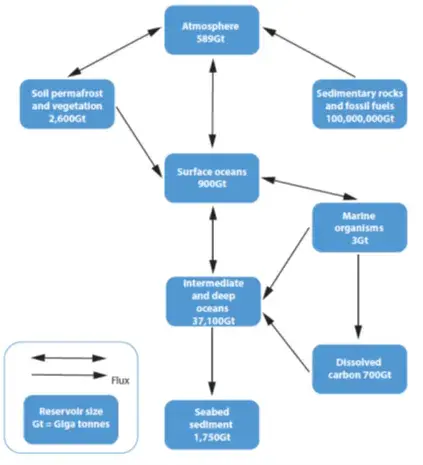

# AO1 v. AO2 (3)

Following a recent online CPD on the Water/Carbon cycles I undertook for a school, I am reminded of this question, initially from an Edexcel (Pearson) context. The question could occur for any of the three main UK boards, with mark allocations varying from 6 to 12. The time allocated for this answer is about 12/15 minutes. The AO weighting is likely to be balanced.

A reminder: for A level Geography, there are two key Assessment Objectives (AOs):

AO1: demonstrate knowledge and understanding of places, environments, concepts, processes, interactions and change, at a variety of scales.

AO2: apply knowledge and understanding in different contexts to interpret, analyse, and evaluate geographical information and issues.

Knowing how to separate and use these two AOs is fundamental in answering examination questions.

As before, the answer is in two formats:

(a)    Normal font – no AO indicated.

(b)   AOs indicated: AO1 in italics; AO2 in bold.

Figure 1 shows the global carbon cycle. Using Figure 1, assess the role of oceans in regulating the carbon cycle.

Figure 1. The global carbon cycle

Answer 1

The oceans act as a store of carbon. The total ocean store is over 38,000Gt making it a vital component of the carbon cycle and so maintain planetary health. Another key role of the oceans is its ability to absorb carbon dioxide into the surface ocean store (900 GtC). Crucially, this means that it is considered a carbon sink and so highlights the importance of the oceans in regulating the carbon cycle.

There are two key processes that occur in oceans that allow them to be a carbon sink with the atmosphere. Dissolved carbon dioxide is taken from the surface ocean to the intermediate and deep oceans through down-welling currents. Carbon dioxide is also sequestered in the ocean through photosynthesis by phytoplankton and other marine biota which converts the carbon dioxide into organic matter.

Another key role of the oceans is to act as a biological pump transporting carbon from the surface oceans to the intermediate and deep oceans (37,100 Gt). This occurs when as biological organisms die, their dead cells, shells and other parts sink into the mid and deep water. Decay of these organisms then releases carbon dioxide into the intermediate and deep water (dissolved carbon 700 Gt) stores.

Some material sinks right to the bottom of the ocean and forms the sea-bed sediment store (1,750 GtC) where over time, through chemical and physical processes, the carbon is transformed to rocks such as limestone. The carbon sequestered in this store can remain for geological epochs and so regulates the carbon cycle.

Overall, the oceans play a vital role in regulating the carbon cycle by being the largest non-geologic store of carbon as well as being a carbon sink. However, the ability of the oceans to offset the impact of burning fossil fuels is small and if fossil fuel use continues to accelerate the oceans could have an increasingly smaller role to play in maintaining the carbon cycle.

Answer 2

The oceans act as a store of carbon. The total ocean store is over 38,000Gt making it a vital component of the carbon cycle and so maintain planetary health. Another key role of the oceans is its ability to absorb carbon dioxide into the surface ocean store (900 GtC). Crucially, this means that it is considered a carbon sink and so highlights the importance of the oceans in regulating the carbon cycle.

There are two key processes that occur in oceans that allow them to be a carbon sink with the atmosphere. Dissolved carbon dioxide is taken from the surface ocean to the intermediate and deep oceans through down-welling currents. Carbon dioxide is also sequestered in the ocean through photosynthesis by phytoplankton and other marine biota which converts the carbon dioxide into organic matter.

Another key role of the oceans is to act as a biological pump transporting carbon from the surface oceans to the intermediate and deep oceans (37,100 Gt). This occurs when as biological organisms die, their dead cells, shells and other parts sink into the mid and deep water. Decay of these organisms then releases carbon dioxide into the intermediate and deep water (dissolved carbon 700 Gt) stores.

Some material sinks right to the bottom of the ocean and forms the sea-bed sediment store (1,750 GtC) where over time, through chemical and physical processes, the carbon is transformed to rocks such as limestone. The carbon sequestered in this store can remain for geological epochs and so regulates the carbon cycle.

Overall, the oceans play a vital role in regulating the carbon cycle by being the largest non-geologic store of carbon as well as being a carbon sink. However, the ability of the oceans to offset the impact of burning fossil fuels is small and if fossil fuel use continues to accelerate the oceans could have an increasingly smaller role to play in maintaining the carbon cycle.

