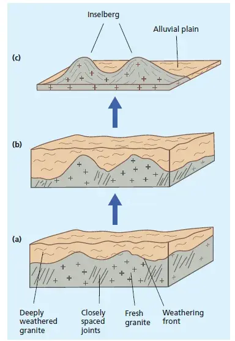
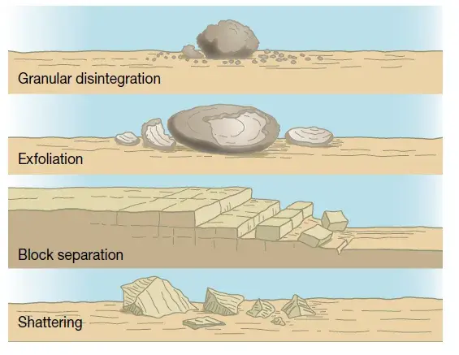
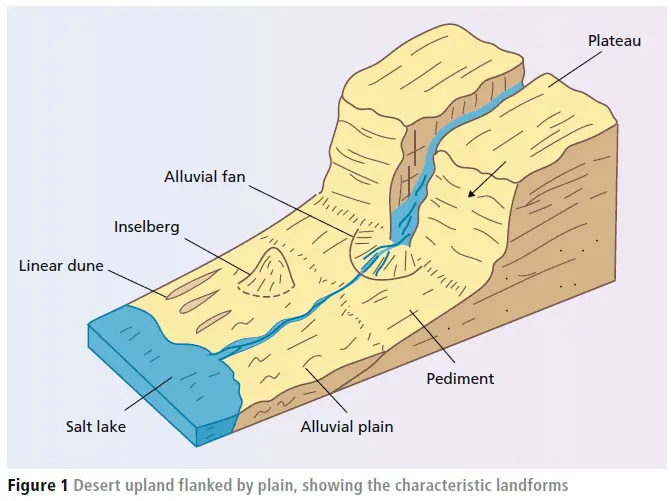
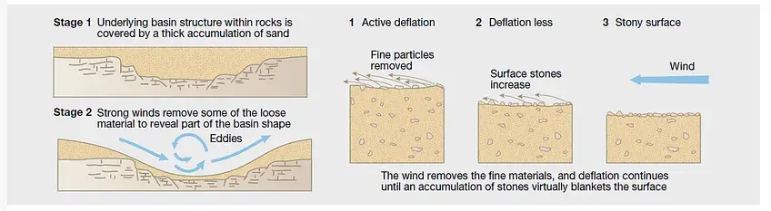

Various factors create the diversity of dryland landscapes.

Land surface

The composition of the land surface has an impact on what happens to the rain falling. For example, compare rain falling on a rock slope vs a salt-rich surface in a topographic depression (a pan, or playa). Water hitting a rock slope will flow over the surface as runoff. In contrast, rain falling in the playa will pond up, dissolve soluble salts, and mostly evaporate or infiltrate.

Energy

Inputs of energy in dryland landscapes come from:

·       the wind, which can pick up, transport and deposit sediment

·       gravity, which provides potential energy for geomorphic processes on slopes

·       insolation, or heat and light from the sun

·       directly from flora and fauna, such as burrowing rodents or termites that build intricate above-ground pinnacle structures.

Sediment

Sediment flows through these landscapes mainly via water (fluvial processes) and wind (aeolian processes). Landforms are created by erosion and deposition of sediment. Water is one of the most important elements in landscape forming, even if it only flows infrequently. The morphology of many dryland rivers is controlled by high-magnitude, low-frequency flow events (big, rare floods).

Large-scale landscapes

At the largest spatial scale dryland landscapes divide into two types:

·       low-relief plains in a tectonically stable setting (e.g. much of central Australia, the central Arabian Peninsula and southern Africa)

·       alternating mountains and enclosed basin drainage (e.g. much of the southwest USA, southern America, Iran, Afghanistan, and parts of central Asia).

Ancient landforms

The mountains and plateaux that are found in several of the world’s great deserts were not formed under an arid climate:

In the Sahara the volcanic massif of the Hoggar originated around 15 million years ago, well before the Sahara existed as a desert, and arose through volcanic activity, not climatic changes.

The mountains north of the Taklimakan Desert in western China existed many millions of years before aridity occurred and were the result of tectonic movements.

The arid Flinders Ranges in South Australia were uplifted and deeply eroded during times of much wetter regional climate than today. Uluru (formerly Ayers Rock) in arid central Australia, and the isolated granite hills known as inselbergs that are so common in the drier regions of Australia, Africa and India formed originally because of prolonged deep weathering under a dense cover of tropical rainforest. When the climate becomes less humid and the plant cover becomes less dense, erosion begins to outpace weathering, until the former deep weathering mantle is stripped off by fluvial erosion and the underlying irregular weathering front is exposed to the elements — an example of an exhumed landscape (Figure 1).

Figure 1. Stages in the revealing of inselbergs.

(a) Weathering of granite bedrock

(b) Weathered layer thickens

(c) Erosion removes weathered layer

Cratons

Vast areas of hot and mid-latitude deserts are underlain by ancient cratons, such as the Yilgarn Craton of arid Western Australia and the Precambrian Shield or Basement Complex rocks in the

Sahara. Some of these areas have been stable for over 500 million years, and some for well over twice that time. Long-term erosion has reduced the landscape to a gently undulating plain. Later invasions by the sea (marine transgressions) have left behind a relatively thin layer of horizontal marine sediments, as in northern Egypt.

Geomorphological processes

Mechanical weathering, involving the disintegration of rocks in situ without any chemical change, takes place in hot deserts due to two main factors:

·       the high rates of insolation

·       the action of salt.

Insolation weathering is the rupturing of rocks and minerals primarily as a result of large daily temperature changes which lead to temperature gradients within the rock mass. These are manifested in a number of ways [Figure 2]:

·       Exfoliation (onion skin weathering) is most noticeable on rocks with few joints or bedding planes (e.g. granite, massive sandstone). It occurs because the surface heat does not penetrate very deeply into these rocks. The outer layers expand and contract daily, but the interior does not. This differential leads to weaknesses parallel to the surface. Layers peel off the rock in an onion-like way.

·       Granular disintegration occurs in rocks that are comprised of minerals of different colours. Darker minerals absorb more heat than lighter ones (e.g. black mica expands more than grey quartz) and so the rock breaks up grain by grain to produce sand sized material. The high tensile stresses involved have been said to cause rocks to split with sounds like pistol shots.

·       Those rocks that are microcrystalline are subject to shattering (thermal fracturing) by constant diurnal expansion and contraction due to heating and cooling respectively e.g. basalt.

·       Block separation occurs predominently on well-jointed and bedded limestones, where the rock breaks up into blocks along these weaknesses.

·       Frost shattering can occur in deserts where there is some free water and the night time temperatures fall below zero. The water gets into fractures in the rock, freezes at night and so expands. Continual freezing and thawing will result in fragments breaking off.

Figure 2. Forms of desert weathering

In recent years doubt has been cast on the pure ‘mechanical’ nature of these processes. Experimental work in the laboratory has failed to re-create these processes in a dry environment. However, when water was introduced, disintegration was more pronounced. On a much larger scale the same has been noticed in the dry deserts of north Africa where large ancient stone buildings remain relatively intact. However, those closer to the Nile for example, show more evidence of decay. Some now believe that the presence of water aids the mechanical processes, perhaps making the rocks swell, or possibly there are some chemical changes involved.

One agent of mechanical weathering that has received more scientific prominence recently is salt weathering. Low rainfall levels means that salts are prone to accumulate rather than being dissolved. The salts include calcium carbonate, sodium sulphate, magnesium sulphate, gypsum and sodium nitrate. They break up rocks in two main ways:

·       When a solution containing salts is either cooled or evaporated, salt crystals will form and pressures accompanying this crystallisation can be great enough to exceed the tensile strength of the rocks in which the solution was contained.

·       Salt minerals expand when water is added to them. This change of state is called hydration. In the case of sodium sulphate and sodium carbonate the expansion may be as great as 300%. If these salts are in the rock, the pressures generated can break the rock.

There is considerable evidence for the prevalence of salt weathering in hot deserts. The rapid decay of buildings in salty areas has been noted in Pakistan, Bahrain, and Suez. In such areas telegraph poles and gravestones seem to act as wicks to salty groundwater and suffer from salt crystallisation as the water evaporates.

With the general lack of water in the desert environment, most forms of mass movement rely on the natural force of gravity. Rock falls and occasional rockslides are the main form of movement whereby weathered or fragmented rock falls from a slope high up down on to the ground below. However large deposits of weathered material are not common due to the action of the wind and occasional intense flows of water which rapidly remove them – see the following section on desert slopes.

Large landforms of erosion and deposition

Sand dunes

Sand dunes are an archetypal desert landform. However, only about 20% of the Sahara Desert is covered in wind-blown sand, and much of this is gently undulating sand sheets rather than dunes. Nearly 40% of the continent of Australia is covered in wind-blown sand and sporadic areas of linear dunes, but these sand plains and dunes are mostly vegetated and stable.

They can reach gigantic dimensions (up to half a kilometre high in the Badain Jaran desert) but come in all shapes and sizes. However, dunes only make up around a third of drylands. They occur in lowland regions, where there is a large supply of sediment and a suitable area for sediment accumulation.

Dune type is controlled by factors including the volume of sand available, the variability of the wind, the amount and type of vegetation cover and the time over which the dunes have been forming. The orientation of the dune in relation to the dominant wind direction determines whether it is stationary or migrating.

·       Some dunes are linear or longitudinal dunes (in Arabic seif or ‘sword’ dunes) and reflect the main direction of sand transporting winds.

·       Crescentic barchan dunes are found where the sand supply is limited. These dunes are aligned at right angles to the dominant wind and can move quite rapidly.

·       Clay dunes or lunettes are a distinctive type of dune that form on the downwind margins of seasonally fluctuating desert lakes and consist of aggregates or sand-sized pellets of clay exposed during times when the lake level is low.

Gravel plains and hamada

Far more common than desert dunes are vast gravel plains, known in Arabic as serir, which consist of fine alluvial sediments with a veneer of fine gravel. In Australia, these grave- capped alluvial plains are called gibber plains, from the Aboriginal word for stone or boulder. They are also common in the Gobi Desert of Mongolia and northern China. Extensive sandstone plateaux (or hamada in Arabic) are another common desert landform. They are called stony tablelands in Australia.

Alluvial fans

Another characteristic feature of desert landscapes are the alluvial fans that radiate out from the base of desert mountains. Desert streams often flow in deep trenches in the uplands where they originate, because of tectonic uplift of the mountains. When they emerge from the highlands, flow is no longer constrained by being entrenched and the stream channels fan out, lose energy, and deposit their sediment load along the foot slopes in the form of a low-angle alluvial fan (Figure 3).

Figure 3. Alluvial fan and associated features

<figcaption>Figure 1, desert upland flanked by plain, showing the characteristic landforms</figcaption>

In the case of big rivers like the Blue Nile, which emerges from the well-watered highlands of Ethiopia out onto the semi-arid plains of central Sudan, the alluvial fans extend over hundreds of kilometres from the fan apex. However, in most cases the alluvial fans of desert streams are quite small, usually not much more than a few kilometres long.

Some of the fan sediment is alluvium laid down by seasonal streams which are dry for part of the year. Some consists of poorly sorted angular boulders in a matrix of mud. These deposits come from debris flows which occur when local downpours cause landslides on the desert mountains. Out on the plains, the mountain foot slopes consist of gently sloping rock-cut surfaces or pediments. Many pediments are concealed beneath a layer of alluvial sediments, in which case they are described as mantled pediments.

Wind action in deserts.

As deserts are so dry and vegetation cover so limited, there is little to protect the desert surface against the action of the wind. Wind is able to erode desert surfaces. It does this in two ways:

(a) Deflation: loose, fine material is picked up by the wind and is transported and deposited elsewhere. It can create depressions in the desert floor (deflation hollows) e.g. the Qattara depression in Egypt or it can remove fine sand from a surface, leaving behind coarser stones that blanket the surface to form a reg or desert pavement. [Figure 4]

An extreme manifestation of deflation is the occurrence of dust storms. Due to their high volumes and densities of sand, they can reduce visibility significantly, and can have a huge vertical extent. In July 2014, a dust storm was responsible for the crashing of a passenger airplane travelling from Burkina Faso to Algeria.

Figure 4. Deflation

(b) Abrasion: a sand-blasting effect where fine material carried in the wind is blown at rocks.  Evidence of this can be seen at a variety of scales. Ventifacts are rocks lying the floor of deserts that have been shaped by the wind-driven sand. They usually have sharp edges and smooth sides.

Yardangs

Wind-moulded ridges, called yardangs, can form in a whole range of rock types from sandstone to ignimbrite and in soft sediments, such as lake beds. As with sand dunes, yardangs will only form if the wind is unidirectional or narrowly bi-directional. The elongated, streamlined shape is parallel to the wind direction.

Yardangs can form across a range of scales. The largest (mega-yardangs) can be tens of metres high and several kilometres long. At this largest scale, other processes, such as fluvial incision, weathering, and mass movement, may also play a part in their formation. For example, the initial incision of the sediment may have involved water erosion, or salt or insolation (thermal stress) weathering, as well as wind abrasion. Once the ridges are established, material may also be removed from yardang slopes via mass movements.

Rock pedestals

Sand-sized material can be transported by the wind in the near-surface zone via suspension or in a bouncing motion known as saltation. This effectively ‘sand blasts’ any surface up to a height of around 2m and is most concentrated in the lowest 0.5m. Distinctive mushroom-shaped features, known as rock pedestals, are formed by this sand-blasting erosion.

Small-scale features

Wind abrased pebbles and boulders are known as ventifacts. Depending on the material being sand-blasted, surfaces may be polished smooth, or with fine lineation or enlarged pitting. Again, there may be more than one surface-moulding process. For example, salt weathering is common in drylands, as is insolation weathering.

The surface of sandy deserts is often covered in the smallest aeolian depositional bedform, ripples, around 0.6–14 mm high and spaced at around 13–300 mm. They form perpendicular to sand-transporting winds, and can also be produced in gravel-sized material and even volcanic pumice, where the mega-ripples can reach heights of around 2 m. They are a distinct landform that does not grow into dunes through time and tends to be short-lived.

An unusual, small-scale feature on sandy deserts surfaces is fulgurite - hollow tubes of fused sand-rich sediment that has been lightning-blasted to temperatures of around 1,800ºC.

Oases

In places where the regional water-table reaches the ground surface, springs of fresh water emerge and create oases which attract plants, animals, and small groups of humans. During times when drought was widespread and good pasture was scarce, they were often attacked by marauding bands of desert pastoral nomads.

When the Sahara was green

Between 15,000 and 5,000 years ago the Sahara was wetter than it is today. A network of rivers and lakes developed during this wet interval, enabling large fish such as Nile perch, as well as crocodiles and hippos, to move from the Chad Basin and the Nile Valley into the heart of the Sahara.

During a prolonged drought about 8,000 years ago, the lakes dried out. They refilled between about 7,000 and 5,000 years ago, attracting new human occupation, but this time the focus was on cattle herding, vividly recorded in rock paintings scattered across this vast region.

When the climate became arid once more, the lakes dried out and a distinctive landscape of furrows and yardangs was carved out by wind carrying abrasive sand grains. The orientation of the yardangs and the erosional furrows between them clearly indicate the direction of the dominant winds at the time these features were formed.
