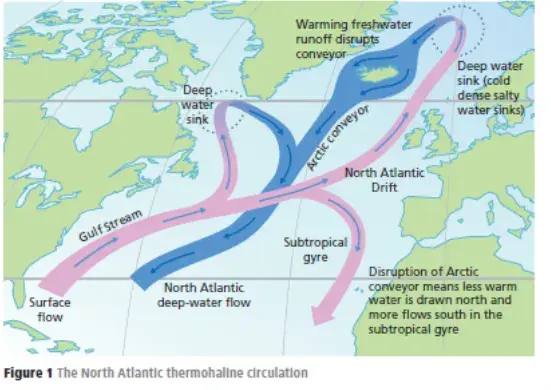
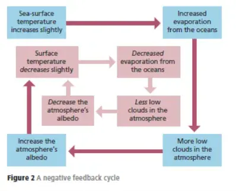
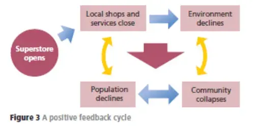

# Feedback
Heading towards 400 subscribers - thank you.

There was a brief discussion amongst Geography teachers about Feedback on Twitter recently. It has prompted me to recycle this….

What do these two different geographical phenomena have in common: the thawing of the permafrost zones of northern Eurasia and North America, and the building of large supermarkets in suburban areas of UK cities? The answer lies in the degree to which an initial activity can have consequences which both spread, and intensify. They both illustrate the concept of feedback.

You will have become familiar with systems theory. Feedback is probably one of the most important aspects of this. Feedback occurs when one element of a system changes because of an outside influence. This will upset the dynamic equilibrium, or state of balance, and affect other components in the system. Negative feedback is when a system acts by lessening the effect of the original change and ultimately reversing it. Positive feedback occurs within a system where a change causes a further, or snowball, effect, continuing or even accelerating the original change.

Feedback in permafrost areas

Scientists are concerned that in a warming world, some of the permafrost will thaw out and release methane gas contained in the icy, organic material. Methane is a powerful greenhouse gas and researchers estimate that the amount in permafrost equates to more than double the amount of carbon currently in the atmosphere.

It has been reported that in the northern region of Alaska, the permafrost has been warming at about one-tenth of a degree Celsius per year since the mid 2000s. The warming of the permafrost has been linked to trees toppling, roads buckling and the development of sinkholes. One theory is that, based on current evidence, parts of Alaska, around Prudhoe Bay on the North Slope, the permafrost will not just warm up but will thaw by about 2070-80. While engineering can prevent the thawing of permafrost underneath important structures, there is little that can be done to prevent the general melting of the layer.

This is a form of positive feedback with seemingly negative outcomes. As the permafrost undergoes its melting process, greenhouse gases that were previously trapped within the permafrost are now being released into the atmosphere, such as CO2 and methane. Due to warming temperatures in the arctic, the release of massive amounts of carbon and other greenhouse gases could further accelerate the pace of climate change – in other words, once started, the warming process will continue. The rate of carbon released from permafrost soils is highly uncertain, but it is crucial for predicting the strength and timing of the carbon-cycle feedback effect, and thus how important permafrost thaw will be for climate change this century and beyond.

Professor Ted Schuur from Northern Arizona University has said ‘Even if we stopped all emissions today, the Arctic has momentum where there is going to be more warming, more permafrost degradation and some carbon coming out already - we have started the ball rolling in some senses.’ Prof Schuur also states that indirect impacts of warming were also speeding the thaw. In Alaska in 2015, there were near-record wildfires, which he said heightened the exposure of permafrost to warmer air.

Arctic sea ice and feedback
Scientists believe that the melting of sea ice in the Arctic, again due to climate change, could make the Arctic Ocean less saline and warmer. Sea ice is fresh water, and when this melts it creates a layer of relatively fresh water on the surface of the ocean.

Under normal conditions, cold salty water, which is more dense than fresh water, sinks to the depths of the ocean and this downward movement draws more surface water from the south to replace the subsiding water. The surface water which is pulled in from the North Atlantic is an extension of the Gulf Stream called the North Atlantic Drift and is much warmer. This flow of cold water to the south and warm water to the Arctic is known as the North Atlantic thermohaline circulation.

An increase in fresh water on the ocean surface from melting sea ice in the Arctic would weaken this flow. If the flow of warm water in the Gulf Stream stopped completely it would cause dramatic cooling of the climate in north-west Europe. The UK would have a climate similar to that of Siberia.

So, once again, an initial event, or change to a system, triggers further changes which can run out of control – another form of positive feedback with negative outcomes.

The North Atlantic Thermohaline circulation

Sea ice is also a critical element in the global weather system. Ice has a high albedo of 80%, and this is a major reason why the poles remain cool. Loss of sea ice can have a disproportionate effect because of this albedo. If a small amount of sea ice is lost, the newly exposed ocean absorbs more heat, warms up and is therefore likely to melt more sea ice, opening up more areas of open sea, and so on. The atmosphere above the water surface will be warmed which will have an impact of pressure systems and wind patterns. This positive feedback process means that a small change in sea-ice extent can quickly lead to enormous changes in global climates and an extended period of sea-ice reduction. In theory, this could lead to an ice-free Arctic.

Not all aspects of feedback are necessarily negative in form however. Consider this scenario. With climate change warming huge areas of oceans, there will be increased levels of evaporation. This in turn creates more cloud, especially in the lower atmosphere. These will present a barrier to incoming solar radiation (insolation) and hence more will be reflected away – the albedo effect will increase. This in turn will reduce temperatures at the sea surface and hence lower rates of evaporation. In this small sense therefore the system has a self-correcting status – a form of negative feedback.

A negative feedback cycle

Finally, where does the supermarket in the suburban area come into this? An example is where a major retailer opens a new supermarket in an area with many small local shops. The supermarket immediately puts pressure on the local shops and may cause them to close. Some might argue that the streets where the former shops existed will become rundown, or taken over by less-desirable activities such as betting shops and fast food outlets, and a form of environmental decline takes place. The area becomes less attractive to other businesses and people and the spiral of decline continues. Once again we have a positive feedback cycle, with a negative outcome.

A positive feedback cycle

Points for discussion

1.      Consider one or more natural landscapes you have studied. What aspects of the processes that have created that landscape can be viewed as feedback mechanisms?

2.      Consider how the concept of feedback (positive and negative) can be applied to other human geography contexts of your choice.

