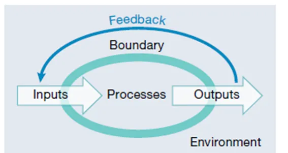
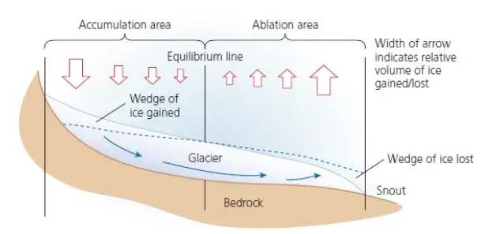
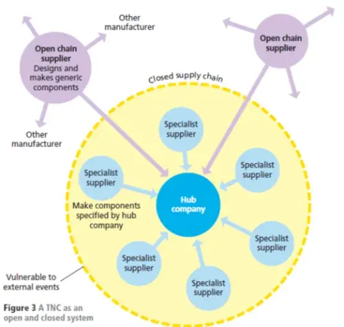

Adapted from an article in Geography Review published in 2017:

Do you own a smartphone? When you take delivery of a new phone it comes pre-loaded with various programs that allow it to operate; it may also contain a few standard applications (apps) such as a camera, a browser, a calendar, Google maps, a weather app. One of the key things that might have influenced your purchase of the phone is its storage capability – how many gigabytes (Gb) it has available for your use.

Subscribe
Probably the first thing you do is to input more applications, such as Spotify, WhatsApp, Snapchat and Instagram. These apps all have a size, given in megabytes (Mb), that take up some of the storage. They also operate as part of a wider system, connecting with similar apps on the phones of your friends and family. Then you will decide to output some text messages, or make phone calls, or post images on to social media. As you become more familiar with its processes, you become more confident and efficient in your use of it, as if you are in balance, or equilibrium, with its functions.

Over time your phone’s memory, its storage, will begin to fill with material you want and knew about, and other ‘stuff’ you probably didn’t realise it kept. If you open the Settings tab, you will find more about the amount of data stored (known and unknown), and you may have the confidence to clear out the ‘cache’ on the phone for each app. Depending on the size of the memory of the phone it may reach a point where it can take no more – it becomes ‘full’, and its speed and efficiency begin to reduce. Whereas once the phone was in a state of equilibrium with your needs, it soon begins to shed its dynamism, reducing its functionality. You will have to do something about its storage to reset an efficient phone again.

Had you noticed? Your phone is illustrating some aspects of systems theory.

Figure 1. General characteristics of systems

Systems in geography

A system is a collection of interrelated parts that work together in an environment by way of some driving process. These parts are a series of stores (or components) that have flows (sometimes called fluxes) between them. Most systems share the same common characteristics [Figure 1]:

·         they have a structure that lies within a boundary

·         they are generalisations of reality, removing incidental detail that obscures fundamental relationships

·         they function by having inputs and outputs of material (which could be energy and/or matter) that is processed within the stores causing the system to change in some way

·         they involve the flow (flux) of material between components (stores).

Systems can be classified as:

·         isolated systems: these have no interactions with anything outside the system boundary. There is no input or output of energy or matter. Many controlled laboratory experiments are this type of system, and they are rare in nature

·         closed systems: these have transfers of energy both into and beyond the system boundary but not transfer of matter. The Earth can be considered to be a closed system

·         open systems: these are where both matter and energy can be transferred from the system across the boundary into the surrounding environment. Most ecosystems are examples of open systems. Coastal sediment cells are often described as closed systems, but in reality sediment does make its way around headlands, to make them small-scale open systems.

Where there is a balance between the inputs and outputs, the system is said to be in a state of dynamic equilibrium. This means that the stores stay the same. However, if one of the elements of the system changes, for example one of the inputs increases without any corresponding change in the outputs, then the stores change and the equilibrium is upset. This is called feedback. Feedback may be positive or negative (see an earlier Substack).

Sometimes systems may have smaller systems operating within one larger system. These are called sub-systems, and their dynamic equilibrium may upset other aspects of the larger system. For example, the drainage basin sub-system is part of the larger water cycle system.

Some examples of systems

1. As stated above, in the case of the water cycle we might consider the sub-system of a drainage basin which has inputs of rainfall from the atmosphere, outputs of river discharge (to the sea) and evaporation (to the atmosphere) and includes storage on the surface (lakes, rivers and even puddles) and sub-surface storage as soil moisture and groundwater. Flows (fluxes) include infiltration and percolation.

2. Landscapes can be viewed as a geomorphological system. Here sediment is often transferred from one store to another by a series of flows. Consider a single landform such as a sand dune. Inputs would be windblown sediment deposited on the windward side of the dune and outputs would be material eroded from the leeward slope. The change in storage is the difference between the input and output. Where it is positive there is net deposition of material, and the dune grows. A negative change in storage represents erosion of material from the dune, and it reduces in size.

This sediment budget approach can be expanded from a single landform to look at larger landscape components. For example, when looking at a glacial landscape, there are inputs of sediment from weathering on the upper slopes and erosion by the glacier which then transfers the sediment to lower levels. This is also influenced by the sub-system of the glacial budget and the balance between accumulation of snow and the ablation (melting) of it [Figure 2]. When accumulation is greater than ablation, there is net growth of the glacier, and more material is transported. When ablation is greater than accumulation, there is a net loss of the glacier, the snout retreats, less sediment is eroded, and large amounts of debris are deposited across a large area by either the melting ice, or fluvioglacial meltwater flowing from the glacier. If accumulation and ablation are in balance, in equilibrium, then the glacier is at a standstill and there are reduced flows of sediment. This is when the landform known as an end moraine is created.

Figure 2. The glacial budget

Systems in geography

A system is a collection of interrelated parts that work together in an environment by way of some driving process. These parts are a series of stores (or components) that have flows (sometimes called fluxes) between them. Most systems share the same common characteristics [Figure 1]:

·         they have a structure that lies within a boundary

·         they are generalisations of reality, removing incidental detail that obscures fundamental relationships

·         they function by having inputs and outputs of material (which could be energy and/or matter) that is processed within the stores causing the system to change in some way

·         they involve the flow (flux) of material between components (stores).

Systems can be classified as:

·         isolated systems: these have no interactions with anything outside the system boundary. There is no input or output of energy or matter. Many controlled laboratory experiments are this type of system, and they are rare in nature

·         closed systems: these have transfers of energy both into and beyond the system boundary but not transfer of matter. The Earth can be considered to be a closed system

·         open systems: these are where both matter and energy can be transferred from the system across the boundary into the surrounding environment. Most ecosystems are examples of open systems. Coastal sediment cells are often described as closed systems, but in reality sediment does make its way around headlands, to make them small-scale open systems.

Where there is a balance between the inputs and outputs, the system is said to be in a state of dynamic equilibrium. This means that the stores stay the same. However, if one of the elements of the system changes, for example one of the inputs increases without any corresponding change in the outputs, then the stores change and the equilibrium is upset. This is called feedback. Feedback may be positive or negative (see an earlier Substack).

Sometimes systems may have smaller systems operating within one larger system. These are called sub-systems, and their dynamic equilibrium may upset other aspects of the larger system. For example, the drainage basin sub-system is part of the larger water cycle system.

Some examples of systems

1. As stated above, in the case of the water cycle we might consider the sub-system of a drainage basin which has inputs of rainfall from the atmosphere, outputs of river discharge (to the sea) and evaporation (to the atmosphere) and includes storage on the surface (lakes, rivers and even puddles) and sub-surface storage as soil moisture and groundwater. Flows (fluxes) include infiltration and percolation.

2. Landscapes can be viewed as a geomorphological system. Here sediment is often transferred from one store to another by a series of flows. Consider a single landform such as a sand dune. Inputs would be windblown sediment deposited on the windward side of the dune and outputs would be material eroded from the leeward slope. The change in storage is the difference between the input and output. Where it is positive there is net deposition of material, and the dune grows. A negative change in storage represents erosion of material from the dune, and it reduces in size.

This sediment budget approach can be expanded from a single landform to look at larger landscape components. For example, when looking at a glacial landscape, there are inputs of sediment from weathering on the upper slopes and erosion by the glacier which then transfers the sediment to lower levels. This is also influenced by the sub-system of the glacial budget and the balance between accumulation of snow and the ablation (melting) of it [Figure 2]. When accumulation is greater than ablation, there is net growth of the glacier, and more material is transported. When ablation is greater than accumulation, there is a net loss of the glacier, the snout retreats, less sediment is eroded, and large amounts of debris are deposited across a large area by either the melting ice, or fluvioglacial meltwater flowing from the glacier. If accumulation and ablation are in balance, in equilibrium, then the glacier is at a standstill and there are reduced flows of sediment. This is when the landform known as an end moraine is created.

Figure 2. The glacial budget

Systems in geography

A system is a collection of interrelated parts that work together in an environment by way of some driving process. These parts are a series of stores (or components) that have flows (sometimes called fluxes) between them. Most systems share the same common characteristics [Figure 1]:

·         they have a structure that lies within a boundary

·         they are generalisations of reality, removing incidental detail that obscures fundamental relationships

·         they function by having inputs and outputs of material (which could be energy and/or matter) that is processed within the stores causing the system to change in some way

·         they involve the flow (flux) of material between components (stores).

Systems can be classified as:

·         isolated systems: these have no interactions with anything outside the system boundary. There is no input or output of energy or matter. Many controlled laboratory experiments are this type of system, and they are rare in nature

·         closed systems: these have transfers of energy both into and beyond the system boundary but not transfer of matter. The Earth can be considered to be a closed system

·         open systems: these are where both matter and energy can be transferred from the system across the boundary into the surrounding environment. Most ecosystems are examples of open systems. Coastal sediment cells are often described as closed systems, but in reality sediment does make its way around headlands, to make them small-scale open systems.

Where there is a balance between the inputs and outputs, the system is said to be in a state of dynamic equilibrium. This means that the stores stay the same. However, if one of the elements of the system changes, for example one of the inputs increases without any corresponding change in the outputs, then the stores change and the equilibrium is upset. This is called feedback. Feedback may be positive or negative (see an earlier Substack).

Sometimes systems may have smaller systems operating within one larger system. These are called sub-systems, and their dynamic equilibrium may upset other aspects of the larger system. For example, the drainage basin sub-system is part of the larger water cycle system.

Some examples of systems

1. As stated above, in the case of the water cycle we might consider the sub-system of a drainage basin which has inputs of rainfall from the atmosphere, outputs of river discharge (to the sea) and evaporation (to the atmosphere) and includes storage on the surface (lakes, rivers and even puddles) and sub-surface storage as soil moisture and groundwater. Flows (fluxes) include infiltration and percolation.

2. Landscapes can be viewed as a geomorphological system. Here sediment is often transferred from one store to another by a series of flows. Consider a single landform such as a sand dune. Inputs would be windblown sediment deposited on the windward side of the dune and outputs would be material eroded from the leeward slope. The change in storage is the difference between the input and output. Where it is positive there is net deposition of material, and the dune grows. A negative change in storage represents erosion of material from the dune, and it reduces in size.

This sediment budget approach can be expanded from a single landform to look at larger landscape components. For example, when looking at a glacial landscape, there are inputs of sediment from weathering on the upper slopes and erosion by the glacier which then transfers the sediment to lower levels. This is also influenced by the sub-system of the glacial budget and the balance between accumulation of snow and the ablation (melting) of it [Figure 2]. When accumulation is greater than ablation, there is net growth of the glacier, and more material is transported. When ablation is greater than accumulation, there is a net loss of the glacier, the snout retreats, less sediment is eroded, and large amounts of debris are deposited across a large area by either the melting ice, or fluvioglacial meltwater flowing from the glacier. If accumulation and ablation are in balance, in equilibrium, then the glacier is at a standstill and there are reduced flows of sediment. This is when the landform known as an end moraine is created.

Figure 2. The glacial budget

In a human context, transnational corporations (TNCs) can also be seen to operate as systems, though they tend to be a little more complex. They have inputs (raw materials, labour, and investment) and outputs (products, by-products and waste materials) and between the two are the processes operating within the company. They too are likely to have sub-systems – for example R&D, component suppliers, back-office Human Resource (HR) and finance facilities – which all combine to make the company work as efficiently as possible. They can also be seen to have open and closed elements to their activities [Figure 3].
Figure 3. A TNC as an open and closed system

Conclusion

At their simplest, systems can be understood as ‘black boxes’ in that we simply quantify inputs and outputs with internal processes to create material and energy budgets for that system. On the other hand, they can be very complex. Perhaps the final example of a TNC serves us well in this regard if we return to the start of this article. The smartphone discussed at the beginning is itself an output of a very complex TNC system.

