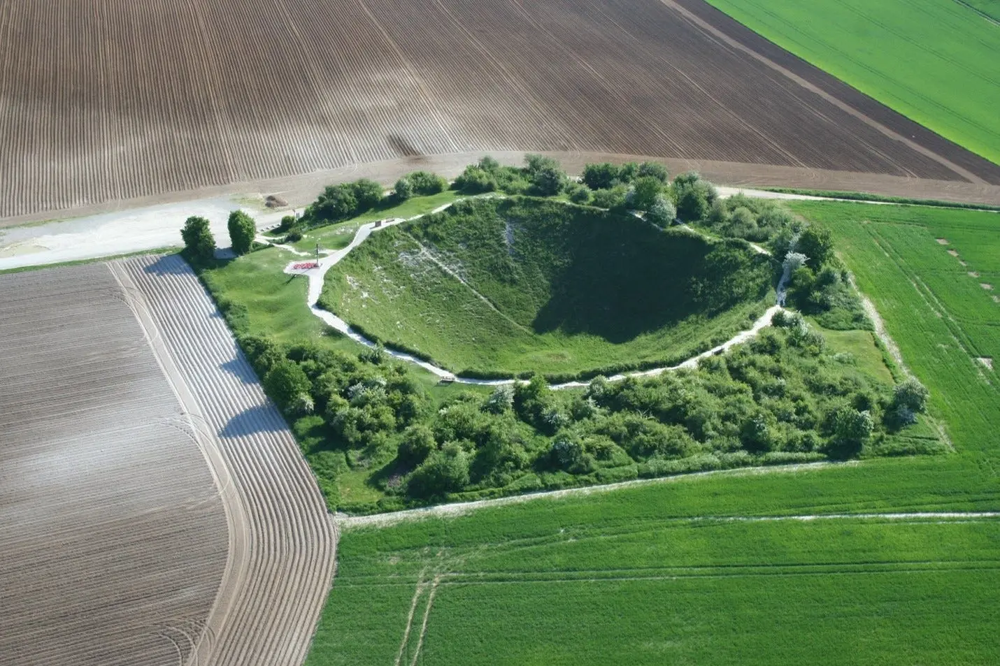
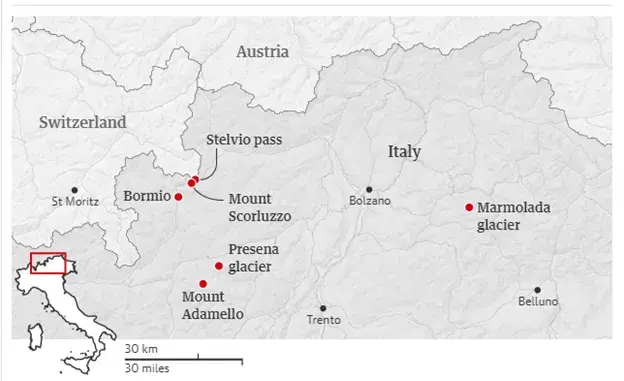
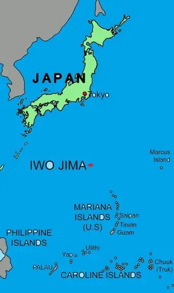

# The connections between landscape, climate change, plate tectonics and military history

Around the world November 11th marks the time when those who have served in the armed forces are honoured and remembered for their sacrifice. In the UK the day is observed as Remembrance (and/or Armistice) Day; in the United States it is called Veteran’s Day. The date was originally chosen to mark the anniversary of the end of hostilities in World War I (WW1), then known as the Great War. In 1918 fighting ceased at the 11th hour of the 11th day of the 11th month with the signing of an armistice between the Allied nations and Germany.

Landscape features

Although WW1 ended more than a hundred years ago, the landscape still records, and reveals its legacy. For example, craters and trenches still scar the terrain of France and Belgium. Some of the trenches, as well as the craters from explosives, are still visible from the air. One such crater is Lochnagar Crater, near the town of Albert (Figure 1). The crater is the result of explosives packed into a long tunnel in the ground, detonated on July 1, 1916, by British forces. The explosion produced a crater that measured 100 metres wide and 21 metres deep.

Figure 1. Lochnagar Crater

Along the shores of the English Channel, in Fratce and England, sea currents and associated shifting sands have revealed sunken WW1 U-boats and airplanes. An example of the former is the UC61 German submarine recently exposed at low tide at Wissant, near Calais.

Furthermore, it is the case that both climate change and cetconic ativity are revealing more evidence of past conflict.

*Climate change*

High in the Alps between Italy and Switzerland, on the slopes of Monte Scorluzzo, retreating glaciers have exposed a cave bunker dating from WW1 [Figure 2]. Although locals have known that the bunker existed, it was re-discovered in 2015, and in May 2021, archaeologists began exploring it in earnest. The wooden-walled bunker was used by troops during the ‘White War’, a lesser-known front where Italian and Austro-Hungarian troops fought high in the mountains between 1915 and 1918.

When the cave bunker was abandoned in November 1918, the soldiers left behind remnants of daily life, including empty food tins, straw beds, uniforms, lanterns, newspapers, postcards, and animal bones with the marrow sucked out. The artifacts are currently being conserved, with plans to display them from 2022 at a nearby museum in Bormio, Italy.

Over recent decades, the melting of Alpine glaciers due to climate change has revealed other artifacts of war including planes and the remains of soldiers. In 2017, a hiker stumbled across the body of a WW1 Italian soldier (he was draped in the Italian flag) on the Adamello glacier. Elsewhere, the relatives of an Italian soldier found on the Presena glacier were able to bury him after documents revealing his identity were found with his body. In the region around Monte Scorluzzo, glaciers have lost over 40% of their surface area between 1954 and 2017, and these melting rates are increasing further. The Stelvio glacier on the mountain has lost 100m of thickness.

Figure 2. Location map &ndash; northern Italy

Elsewhere, in Greenland, in 1992, a WW2 airplane, a P-38 Lightning fighter aircraft, was discovered and removed from a thinning glacier. It was part of the so-called ‘Lost Squadron’ when a number of planes crashed in the Greenland ice and disappeared. The planes were travelling through a chain of secret airbases in Newfoundland, Greenland and Iceland known as the Snowball Route. Hundreds of U.S. aircraft flew this route during WW2 as part of Operation Bolero, which delivered warplanes, pilots, equipment and supplies for the planned Allied invasion of Nazi-occupied Europe. But after flying into a severe blizzard, eight aircraft from the lost squadron were forced to crash-land on the surface of the glacier beside Køge Bay in south-eastern Greenland. Since then, more of the ‘Lost Squadron’ have been found using drone technology, and it is hoped that these planes can be recovered, along with the bodies of the crew.

Tectonic processes

Tectonic processes have also revealed artifacts of military history. In October 2021, an underwater volcanic eruption near the island of Iwo Jima, 1,200km south of Tokyo, caused seafloor uplift that brought several sunken WW2 ships to the surface. [Figure 3]

Figure 3. Location of Iwo Jima

The seismic activity raised two dozen ‘ghost ships’ - sunk after one of World War II's most famous battles - from the bottom of the Pacific Ocean. In total, 24 Japanese warships were washed ashore on the western side of the island of Iwo Jima, after they were pushed up, along with the seabed, by the underwater volcano Fukutoku-Okanoba.

U.S. forces sank the ships during the Battle of Iwo Jima in 1945. This was one of the bloodiest battles in WW2; the 36-day assault saw roughly 70,000 U.S. Marines fight around 20,000 Japanese soldiers hiding out in bunkers within the island's volcanic rocks. By the end of the battle, 20,000 US marines had been wounded and nearly 7,000 killed. All but 216 Japanese soldiers, who were captured alive, were killed in action.

The smashed, sea-bleached wrecks are the remnants of transport vessels that were captured by the U.S. Navy and deliberately scuttled in the aftermath of the battle. As Iwo Jima had no port, the ships were sunk parallel to the shoreline to form a breakwater - shielding both weapons and troops from oncoming waves as they were unloaded onto the island.

Iwo Jima is part of the Bonin Islands, a chain of roughly 30 islands in the Pacific Ocean. Created by the subduction of the Pacific tectonic plate below the Philippine Sea Plate, the island chain is prone to earthquakes and volcanic eruptions, and it had been experiencing an increase of seismic events during the summer of 2021.

The volcano Fukutoku-Okanoba began erupting underwater August 2021. Besides pushing the ships, and the seabed they are resting upon, into view, the seismic activity produced by the volcano has led to the emergence of a small, crescent moon-shaped island from the sea. Formed from pumice and volcanic ash, the island is expected to vanish within months due to sea erosion.

Barring another eruption of the surface volcano on the island, Mount Suribachi, or the sinking of the seabed that the ghost ships are resting upon, the once sunken boats are likely to remain on the island for the foreseeable future. Iwo Jima island is uninhabited and rarely visited by civilians - partly due to the enormous quantities of unexploded bombs and grenades left behind on the island. As a result, it is unlikely that the ships will be cut up for scrap or removed by Japanese authorities.
