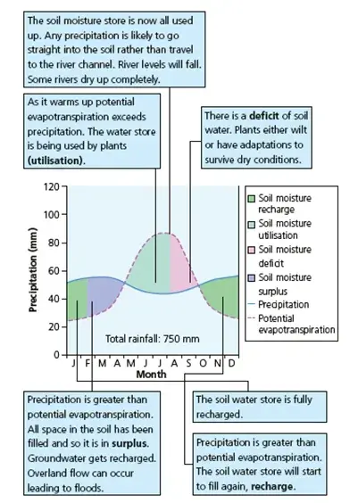

# The Water Balance

The water balance is the balance between inputs to the system from precipitation, and outputs from evapotranspiration (Figure 1). The balance between the two determines changes in storage such as soil water, and how much water passes through our rivers as discharge.

Figure 1 Water budget graph for a cool temperate location such as the UK

Inputs and outputs

The only input of water into the system is precipitation. This can either be liquid - rainfall, or solid - snowfall.

In terms of outputs, water is lost to the atmosphere via evapotranspiration, made up of two elements: evaporation and transpiration.

Evaporation is the process whereby liquid water becomes water vapour and diffuses into the air as a gas. This process is driven by heat. Evaporation takes place from puddles, lakes and reservoirs, and from droplets on vegetation or other surfaces. Water is also evaporated from the upper layers of soil.

Potential evaporation is a measure of how much water vapour could be absorbed by the atmosphere if the amount of liquid water available was not limited.

Transpiration is the taking up of water by vegetation mainly for use in photosynthesis. Plants take up water in the soil through their roots. It is eventually lost to the atmosphere as water vapour, from stomata (pores) in the leaves. Rates of transpiration vary, depending on climate conditions and how much water is available in the soil.

Key water cycle processes

Interception

Interception occurs when precipitation lands on vegetation instead of reaching the ground surface. This water can be stored on the leaves and flowers of trees and other vegetation. Some of this intercepted precipitation might eventually reach the ground as it flows along leaves and branches (stemflow), or falls through the leaves (throughfall), particularly when there is a lot of precipitation. However, some of it will evaporate back into the atmosphere.

Infiltration

Water enters the soil by infiltration. The water entering the soil could be inputs from direct precipitation, from throughfall or stemflow, or from water flowing over the soil surface.

Streamflow (discharge)

When inputs exceed outputs, as well as increasing the amount of water held in stores, the surplus water leads to an increase in streamflow (discharge). In particular this occurs when stores are full (i.e. soils are saturated), or when water cannot enter the stores quickly enough. New water entering the stores can also force out older water into the stream channel, increasing discharge.

Stores

Water is stored in different ways in a catchment.

Soil water

Soil is made up of solid particles, surrounded by gaps known as pore spaces. These spaces can be filled with air or water. When all the pore spaces are filled with water instead of air, the soil is saturated. In most cases saturation doesn’t last very long, as there are a number of forces acting on the pore water. Gravity draws the water down from the surface to deeper soil layers, so that the water in pore spaces drains away following rainfall. Capillary forces are also at play. These are the attractions between one water molecule and another (called cohesion), and between water molecules and soil particles (called adhesion). These forces can be stronger than the downward pull of gravity, so that as water drains away after it rains, some remains in the soil. When some water is held in the soil by capillary forces, but the pore spaces are not full, the soil is said to be at field capacity.

As well as gravitational drainage, soil water may also be lost through evaporation and transpiration. If the water lost through these processes is not replaced by rainfall, the amount of water in the soil gradually decreases until the soil reaches wilting point. This occurs during a water deficit (Figure 1).

Groundwater and surface water

Water can also be stored in other parts of a catchment, such as in its bedrock (groundwater), or in water bodies such as reservoirs, lakes or even puddles (surface water). Water held in bedrock can remain there over long timescales.

Annual variability

Winter

·       In the UK, we tend to have wetter winters than summers (Figure 1) – precipitation events occur more frequently then.

·       Rates of interception are lower in winter, as some vegetation loses its leaves during winter.

·       This means that inputs are relatively high at this time of year.

·       In terms of outputs, rates of evapotranspiration tend to be lower in winter due to lower temperatures (less heat).

·       Transpiration is lower as some plants die back in winter, so do not need as much water for photosynthesis or other key processes.

·       As inputs of water are high and outputs are low in winter, this leads to water surplus.

·       Some of this surplus water is stored as surface water, groundwater or soil water, keeping soils at or close to field capacity.

·       Some of the surplus water may lead to high river levels and flood events.

Summer

·       In summer, precipitation events tend to be less frequent and shorter, and interception is increased as vegetation becomes leafier, so inputs to the system are lower (Figure 1).

·       There is less water available to infiltrate into the soil, or to enter the other stores.

·       Rates of potential evaporation increase due to warmer air temperatures, and there is more transpiration during the growing season.

·       As inputs are low and outputs are high, the amount of water in stores decreases.

·       During warm, dry periods, soils move away from field capacity towards wilting point. Streamflow also tends to be lower.

Autumn

·       During the autumn, precipitation increases and interception decreases, increasing inputs.

·       Evaporation and transpiration decrease, reducing outputs.

·       During this period, the amount of water in stores begins to increase again, until field capacity is reached.

Climate change

Climate change is likely to impact on all these processes:

·       Winters are likely to become drier, reducing stores.

·       Summers are also likely to become drier, yet more frequent intense storms may result in short periods of excess rainfall input. Such high impact storm events are likely to increase associated flooding.

