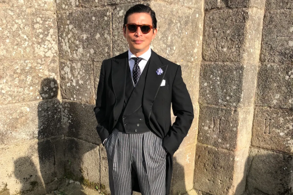
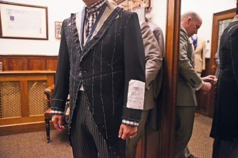

### Wei Koh's morning suit

[source](https://therake.com/stories/ive-seen-the-light)

> The most formal and correct morning coat is a single-breasted peaked-lapel jacket with a link closure that cuts away in the front and falls to the knees. Indeed, it was explained to me by the amazing Dario Carnera, head cutter at the mythical Huntsman tailors of Savile Row, that you gauge the quality of a bespoke morning coat by how perfectly it tucks to the back of the knees. It is accompanied by a grey, buff or black double-breasted shawl- or peak-collar waistcoat, and both the jacket and waistcoat can be piped and should feature dress slips, a layer of white fabric that just underlies the top edge of the waistcoat to give the illusion of a second layer beneath it.

