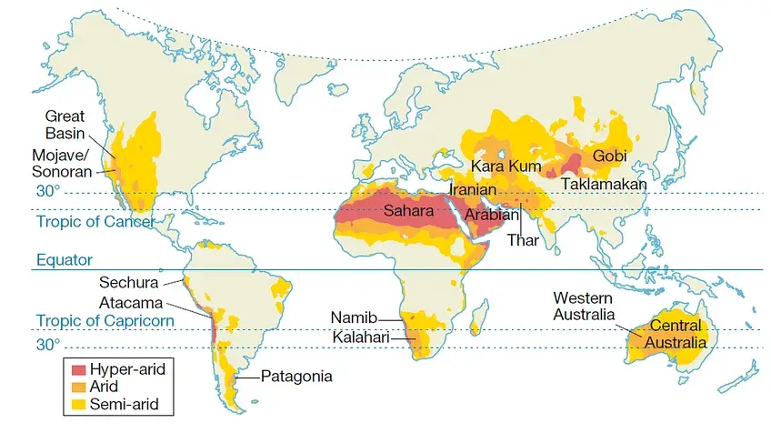
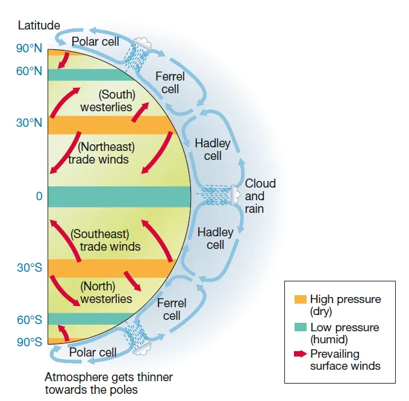

# Drylands, part 1

[Original source](https://dredfern.substack.com/p/drylands)

Around one third of the land on Earth can be classified as dryland (Figure 1), where there is a water-balance deficit.

<!---->

### The water-balance and the aridity index

Aridity, or the lack of water, is the most important criterion in defining deserts or drylands. A simple aridity index (AI) is used by the United Nations Environment Programme (UNEP) to define just how dry a dryland is:

AI = P/PET

where P = mean annual precipitation and PET = mean annual potential evapotraration.

Using the AI the following dryland subdivisions exist (Figure 1):

- hyper arid (AI < 0.05)

- arid (0.05 < AI < 0.20)

- semi-arid (0.20 < AI < 0.50)

Hyper-arid areas cover 4% of the Earth's surface, arid about 15%, and semi-arid another 15%. Therefore combined,
one third of the Earth's land surface is arid in some form - and the home of 20% of the world's population. These areas are often referred to as &apos;deserts&apos; of which the Sahara, Namib, Kalahari, Atacama, Patagonian, Arabian, Thar, Mojave, Sonora, and Australian deserts are the best known. [Figure 1]

There are alternative ways in which deserts are classified. Some refer to warm (or hot) deserts, whereas there are also deserts where, due to either high latitude or high altitude, there are winter frosts (cold deserts). Likewise, coastal deserts such as the Atacama and Namib deserts have very different temperatures and levels of humidity from the deserts of continental interiors. Equally some deserts, such as those in Arabia and Australia, have much less relief (mountains and valleys) than others. The mountain and basin deserts of southwest USA and Iran have much steeper relief and consequently have very different landscape features. Within desert regions of these two structural types, some areas are dominated by wind action, some by the action of water. Some have extensive areas of erosion and others have extensive areas of deposition.

*Reasons for aridity*

Hot deserts occur in four locations where there is very little rain:

- latitudes dominated by dry subsiding air
- inland, far from sources of moist maritime air
- on coasts flanked by cold ocean currents or cold upwelling ocean water
- in the rain shadow of high mountain ranges

*Influence of latitude*

Figure 1 shows that many of the world's largest hot deserts occur in roughly the same latitudes. For example, the Saharan and Arabian desert extend eastwards across the deserts of Iran, Afghanistan, and Pakistan into the Thar desert of India, and lie astride the Tropic of Cancer, roughly between latitudes 15&deg;N and35&deg;N. The southern hemisphere deserts of Australia, the Kalahari and the Atacama are along the Tropic of Capricorn (latitude 23&deg;S). To understand this, we need to consider how the global atmospheric circulation system works.

Global atmospheric circulation

Atmospheric circulation is controlled by solar radiation, which is greatest at the equator because here the sun is directly overhead for much of the year. With distance from the equator the sun’s rays travel more obliquely through the atmosphere because of the curvature of the Earth, and this means that progressively more incoming radiation is reflected or absorbed by the Earth’s atmosphere with increasing latitude. Because of the tilt of the Earth’s axis, the sun is directly over each of the tropics once a year, at the summer solstice.

Hadley cells

Hot tropical deserts like the Sahara are a direct result of the atmospheric circulation cells (often termed Hadley cells) that occur between equator and the tropics [Figure 2]. In other words, the location of these deserts is determined by latitude rather than by the regional distribution of land and sea. As it is heated, the warm air in equatorial latitudes rises by convection, expands, and cools. Cold air can store less water vapour than the same volume of warm air, so the rising air becomes saturated as it cools, and the excess water vapour condenses to form clouds. These humid air masses release much of their moisture over the equatorial zone before moving further from the equator in both hemispheres. As they become cooler and denser, they eventually begin to subside. The tropical latitudes around 20-30&deg; north and south dominated by atmospheric subsidence. Hot tropical deserts like the Sahara and Arabia are in these latitudes, where the air above them is dry and subsiding, and the atmospheric pressure is high for much of the year. The surface winds in such deserts are therefore generally directed outwards, towards areas of lower atmospheric pressure, and so little moisture is brought in by surface winds. As the air over the deserts subsides it is compressed and becomes warmer, so it can absorb additional water vapour. The result is that the relative humidity of desert air is usually very low and only reaches dew point (100% relative humidity) when the night temperatures fall low enough for desert dew to precipitate on chilled rock surfaces, especially the darker ones. This ephemeral dew allows gazelles and other small creatures to survive despite the lack of surface water. The former can be seen licking this dew water from the darker rocks on the ground shortly before sunrise.

*Figure 2. The general atmospheric circulation*

<!---->

*Distance from the coast*

The second major cause of aridity is a location far enough inland to be away from the influence of moist maritme air masses. Rainfall decreases rapidly away from the coast in all parts of the world except those close to the equator. The drying influence of a large land mass is sometimes described as continentality, and this applies to all big deserts, including the great tropical deserts of Arabia, Australia, and the Sahara. In these hot tropical deserts, the dryness caused by latitude is accentuated by continentality. The deserts of central Asia, including the Taklamakan and Gobi deserts of China and Mongolia, are in the interior of mid-latitude continental regions far from the oceans. They are bitterly cold in winter, with temperatures falling as low as –40°C and can experience summer temperatures close to 50°C, which is nearly as hot as the southern Libyan Desert, in the Sahara, in July and August.

*Deserts flanked by cold ocean currents*

Two other factors may either increase the aridity resulting from latitude and continentality or may be the dominant cause of reduced precipitation. These two factors are cold oceanic water immediately offshore from coastal deserts, and the rain- shadow effect created by high mountains. These factors may operate individually or together. The presence close offshore of cold upwelling water or a cold ocean current can cause coastal aridity in tropical and even in equatorial latitudes such as the arid Horn of Africa, flanked by the cold Somali current. In fact, the western borders of all the great tropical or trade-wind deserts in both hemispheres are washed by cool ocean currents associated with the oceanic circulation cells which flow clockwise in the northern and anticlockwise in the southern hemisphere. These include the Atacama and Kalahari deserts. If cool moist maritime air blows onshore it often meets a land surface that is warmer than the adjacent ocean surface, at least in summer and during the day. The cool maritime air mass becomes warmer on contact with the warm surface of the land. The relative humidity of this air mass is therefore decreased, and its ability to absorb additional moisture from surface evaporation is increased. The air therefore has a drying effect upon the land.

Coastal fogs

The main sources of moisture in these often quite narrow coastal deserts are the coastal fogs that blow inland in winter when the land has cooled down relative to the sea-surface temperatures. Coastal fogs are quite common in deserts where mountain ranges like the Andes or the Rockies run parallel and close to the shore.

Rain-shadow deserts

The fourth cause of aridity is the rain-shadow effect, which is a natural phenomenon linked to topography. It is not restricted to deserts. Wherever ranges of hills or mountains lie close to the coast, forming a physical barrier to onshore winds, the incoming moist maritime air will be forced upwards. As described earlier, moist air becomes cooler as it rises and expands, attains vapour saturation, and sheds its condensed water vapour as rain or snow. The air then passes over the coastal ranges and flows downhill, becoming warmer and drier. The area inland of the coastal ranges is described as in the rain-shadow of the ranges - the air has already shed its moisture before passing over this land, which therefore gets little rain. The inland-facing slopes of high mountains are almost invariably drier than the foothills on the coast.

Examples include:

·         the windswept upland plains of Patagonia which lie in the rain shadow of the Andes.

·         the rain-shadow deserts of New Mexico and Arizona that are downwind of the Rockies.

·         both the Afar Depression and the Dead Sea Rift are flanked by high mountainous escarpments and occupy low-lying fault troughs or rifts that in places descend over 150 m below sea level.

If the region inland of the coastal uplands contains high mountains, these may receive some orographic or relief rain, but if the area is flat, there will be none of this rainfall. The gravel plains (serir) of the southern Libyan Desert and the sandstone plateaux (hamada) of the central Sahara, the gobi plains of northern China and Mongolia and the gibber plains of central Australia are all good examples of extreme (hyper) arid environments with very little surface relief. On these stony desert surfaces rainfall and runoff are minimal, and plants and animals are exceedingly rare, even by desert standards.

The high summer temperatures in all these deserts cause high rates of evaporation so that, except for extreme downpours (which are soon lost in flash floods), any rain that falls in summer does little to moisten the soil and help plant growth.

Past climates in deserts.

[Pleistocene - a geological period stretching from 2 million years BP (before present) to 10000 years BP. It was characterised by a series of alternating cold phases (glacials) and warm phases (interglacials) collectively known as the Ice Ages.]

During the Ice Ages of the Pleistocene, the world was very different from today. Many deserts were subjected to increased rainfall - periods known as pluvials. There are several indicators in the present desert environments of higher levels of precipitation in the past.

These include:

·         high lake levels marked by ancient shorelines around now dry and salty closed basins

·         great spreads of spring-deposited lime called tufa indicating former higher levels of groundwater

·         river systems which are currently inactive and blocked by dune fields

·         animal and plant remains together with evidence of former human habitation in areas now too dry for people to survive.

Some of the pluvial lake basins reached huge dimensions, especially in the south-west USA where faulting had created many closed basins in which lakes could accumulate during periods of greater humidity. Lake Bonneville, near Salt Lake City in Utah, is a classic example of such a residual lake, now covered in flat salt deposits. Similarly, on the margins of the Sahara, Lake Chad has fallen in size considerably. It may have been 120m deeper than now, and it extended for hundreds of kilometres north of its present limits. Although climate change of such a marked degree appears to have taken place in the Pleistocene, it is apparent that appreciable fluctuations in climate may still take place. For example, in the 1930s a period of greatly reduced rainfall and higher than average temperatures in the USA contributed to the extreme wind erosion and dust blowing of the ‘Dust Bowl’ years.

The Omani desert
