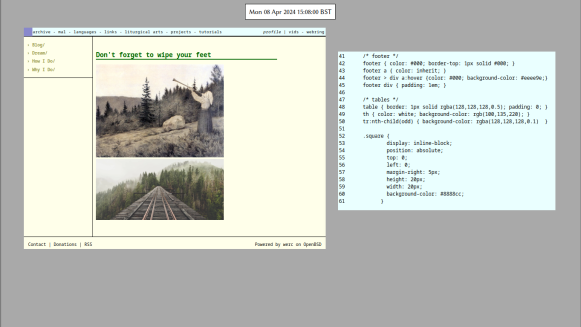

# Criteria

- Has to be floating
- Must be written in a low-level language (preferably Golang or C)
- Wayland ready

# Notable mentions

- [SOWM]
    - 
    - sowm is only 200 SLOC and is written in C
    - No border colors
    - has workstations/tags

- [wio]

- [rio]

<!-- Insert rio screenshot with mothra website -->
