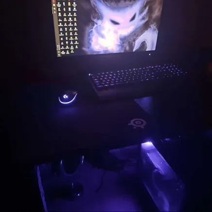
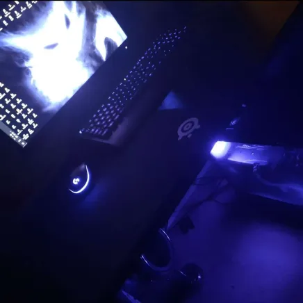

# _Everything you'd want to know about my computing_

### Last updated, 2024 April 15th

Ordered by usage

## Hardware

I use what I guess you'd call a &apos;headless&apos; laptop,

> Although, I think the term &apos;headless&apos; actually refers to laptop's still in their chassis with keyboard, just without the display.

It's the motherboard of a corebooted Lenovo ThinkPad x230. I used it for years as it was originally intended as - a laptop - but decided that laptops breed laziness and are generally harmful, you can see my reasoning [here](). I also did this for performance reasons.

My x230 is corebooted, it was never sold that way originally by Lenovo - rather enthusiasts flashed the proprietary BIOS chip and sold it to me.

I previously held Lenovo's ThinkPad x61s as my sweetheart because of its 4:3 screen and flush keyboard, however coreboot/libreboot is not available for it - so I have zero interest in going back to it.

## Software

- *BROWSER*: Librewolf, Qutebrowser, Surf
    - librewolf, has sane privacy defaults, surf, simply beautiful, nyxt - I need to learn
- *DOCUMENT VIEWER*: zathura
- *EDITOR*: acme, sam, ed
    - Because of clipboard issues, I still use vim when ssh'ing or on my local machine, I'm not attracted to any of vim's features.
- *FILE MANAGER*: lf, clifm
- *OS*: Artix, openbsd
    - In theory, I'd be happy migrating to OpenBSD but because it lacks some packages relating to the cursor, I only use it as a server OS.
- *TERMINAL*: st
- *TYPESETTING*: groff, postscript, latex

## Peripherals

- *MONITOR*: Dell 19" P1914Sc P1914Sf 1280x1024 SXGA 4:3
    - Bought secondhand for &pound;10 plus &pound;7.69 shipping
- *KEYBOARD*: generic membrane
    - I've used mechanical ones before but obsessing over them is a superfluous interest
- *MOUSE*: Left-handed large, Contour classic wired
    - Bought new for &pound;14.09
    - Has three-buttons, useful in Acme

### Hardware I want 

#### Keyboards:

<s>Strikethrough</s> means no longer wanted. *Bold* means highly wanted.

- <s>Tex Shinobi</s>
    - Because of my former musophobia, I rationalised that the superiority of pointing devices applied only to &apos;trackpoints&apos;. I think trackpoints are infinitely better than &apos;touchpads&apos;.

- *IMB/Lenovo ThinkPad Classic keyboard*
    - Sometimes, I am lazy and want to sitback with keyboard on my lap watching anime. Although, good second-hand ones are heavily markedup on eBay. Not good.

- *Keymouse*
    - Very interesting concept, Would like to experiment screwing down trackball-variant to armrest of standing chair.

- <s>Unicomp Endura Pro</s>
    - Same reasons as the _Tex Shinobi_ but the fact these are no longer manufactured by Unicomp and have had issues with the trackpoint makes it undesirable.

- *Maltron*
    - Manufactured, assembled and hand-wired in Britain. Would like to experiment with their single-hand keyboards.

- kinesis

#### Mice

- *Kensington expert track ball*

#### &apos;Devices&apos;

I don't want any more computers or any computers, all I want is a phone that can connect to a hollowed out laptop chassis and serve as a desktop or allow me to ssh into remote servers. I have a rant on this, [here]().

But - I do want a _modern_ corebooted motherboard to serve as a home server, since I don't see using a phone as a server to be reliable. There is a good post on the [MSI PRO Z690-A WiFi DDR4 motherboard](https://www.phoronix.com/review/coreboot-adl-dream).

### Miscellaneous

I'm training myself to exclusively use a standing desk, because I'm human after long periods I do sit down, and type with a keyboard on my lap.

run this command for blue light,

### Danger, truth below

Don't ever waste your money on gaming PC's or &ast;most &apos;mechanical keyboards&apos;. On the most part those &apos;communities&apos; know nothing about ergonomics, efficiency and are man-childs flaunting fancy electronics. If you must game, buy a dedicated console.

Don't buy iPads or tablets to serve as pseudo-computers, especially with stupid physical keyboard accessorie. 

If you have to do computing, buy a used core/librebooted laptop - I'm inclined towards recommending ThinkPads (x220,x230) because I've used those models for years upon years. Buy them used from eBay, never spend more than &pound;60, you will most likely need to buy a new &ast;genuine battery, SSD and other upgrades but it will be worth it.

Don't buy any product from Apple, new or used and almost all Windows laptop companies. They are evil corporations, whoemploy slave-like labour and using their products enhances their desired &apos;signalling&apos; and &apos;networking&apos; effect.

If you're in an industry that requires high-spec machines buy from Framework they seem to be on the side of users. If your job requires software specific to MacOs or Windows - the x230 can run MacOs and Windows 10/11. If you've been assigned a work-specific laptop/computer whose operating system you can't uninstall - get a seperate drive to boot of. If you're UEFI/Legacy BIOS is administrator protected - gently explain your ethical qualms with using a proprietary system to your companies IT guy and ask him to unlock it.

If you do end up using Linux or BSD. Don't become bogged down with &apos;configuration&apos;, many Linux users champion and treat their dotfiles like their children - godforbid someone run `rm -r .config` on their system. I've written about this more, in detail, [here]().

Lastly, a personal story.

I speak about this in hushed tones, this is my old &apos;gaming&apos; pc (insert soyjack now). Don't buy a gaming pc. Don't play games that can't run on old computers. Don't game in general. Massive time vampire.
<!--

-->

`gammastep -l 31.4:64.1 -t 5700:3600 -g 0.8 -m randr -v`

