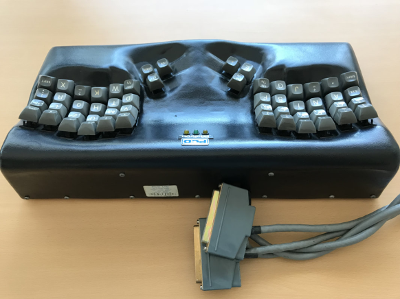

# Maltron

## Legacy Maltron keyboards

> Accessed [here](https://www.maltron.com/legacy-maltron-keyboards--archive.html)

&ldquo;No 500, Type KCA-1, C1980.  The original Maltron keyboard.  Designed with the vastly superior (over QWERTY) Maltron letter layout, notably with the letter E on the otherwise redundant left thumb.  Devlin Key switches were used.
​Click the images to enlarge.&rdquo;

> David Cole

> @batchout

> @xah_lee

> using HIDMacros to make a split MALTRON via remaps. works, but not elegantly! Also, making a Hex keyboard.

> 4:12 AM · Nov 8, 2015
