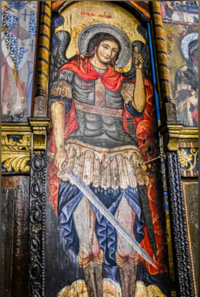
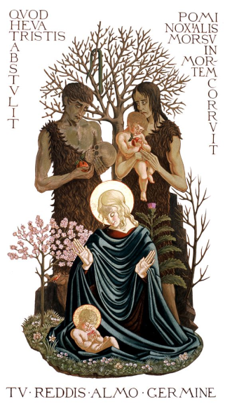
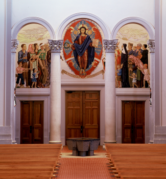
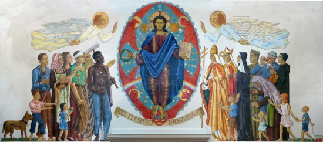
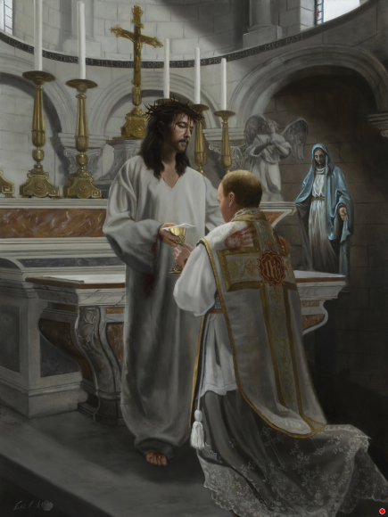
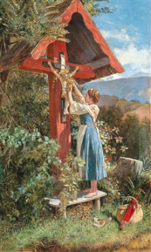

### A place of reflection

> Nothing here belongs to me, the source .html may contain the original links/artists 

<!-- TRINITY -->

<!-- SAINTS -->

<!-- SCENES -->

<!-- CREATION -->

 <!--find original-->

<!-- OTHER -->

<!--(Vienna 1854-1925)
A Wayside Shrine, signed Hörwarter, oil on canvas, 41 x 26 cm, framed, (Rei)-->
<!--Dom Gregory de Wit, OSB, Protoevangelium, 1946–55. Refectory wall mural, Saint Joseph Abbey, St. Benedict, Louisiana.-->
