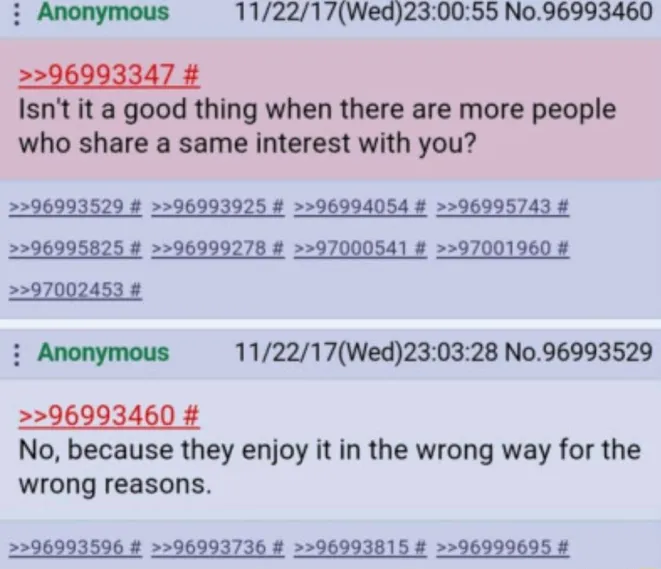

# Mal

> From Old French _mal-_ from the Latin adverb male, from malus

# Prefix

1. evil
    - *mal*icious, *mal*influence
2. poorly, deficiently,
    - *mal*fed, *mal*nourished,
3.  o
    - *mal*igned
4. o
    - *mal*ware

# Affix

Dis*mal*, abyss*mal*

# Notable mals

- Malcontent
    - A world-weary cynic who tries to stand outside the worlds ugliness, while expressing his contempt for it, but gets sucked into it eventually (often to enact some revenge), [source](https://lukemckernan.com/2014/04/05/the-malcontent/)
(https://www.escholar.manchester.ac.uk/api/datastream?publicationPid=uk-ac-man-scw:317134&datastreamId=FULL-TEXT.PDF)

好 
_If criticism destroys much, it creates much more_

_If you think good design is expensive, you should look at the cost of bad design_

_By virtue of doing good you are undercutting someone who is doing bad_

_Imagine Henry Ford stopped making cars because the Horse and Buggy industry sent him a bunch of sob stories_

