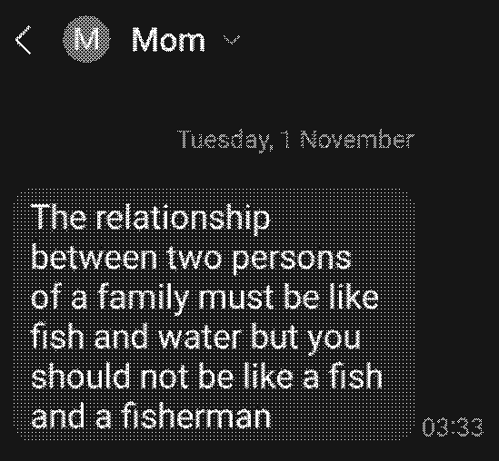

# Quotes

> The di&amp;ldo of consequences rarely arrives lubed

> It looks like a haybale decided to take a nap on his chin

> The Chromium codebase is about 5M SLOC, and much of that code resembles ancient and powerful incantations that could make the dead walk amongst the living

> It costs nothing to be nice, it also costs nothing to be an as$hole

> &ldquo;The Demons! The Demons! They will come from the Twitter Space&rdquo - Unknown Saint

> _He is the only survivor of the Russian sleep experiment_

> _Because democracy basically means government by the people, of the people, for the people. But the people are retarded_

> _The elevator business has its ups and downs_

> _Have you ever heard a crackhead say they don&apos;t have enough money for crack? No. They still go out and get it. Do the same with your dreams!_

> _90% of gambling addicts quit right before they're about to hit it big_

> _Yeah he got a disability, dis ability to cook_

> _On my way to CIA headquarters to pick up my free watch (I found out I made it onto their watch list)_

