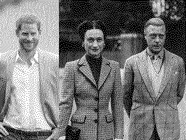
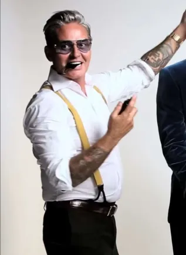

# Tailoring

# Objections

But it fits! Looks fine to me!

# Housekeeping

Most passing tailoring remarks ring deaf to &apos;fashionistas&apos;. I'm more concerned with age-old rules dictating proportions, sizes etc, 

Before you step in, note, this isn't bound to one period or style of clothing. I'm not interested in keeping up with all the nuances and quirks each past era has to offer. 

# &ldquo;Thrifting&rdquo;

In principle, this is good, removes a lot of old clothes from circulation. However, the goal is to scratch that itch of finding utility + satisfaction. Keep in mind a lot of the gems you'll find are from a bygone era, when boxiness was all the rage. This isn't necesarrily bad but - The 80s everything became boxier. Some tailors veer away from should pad surgery, You can remove shoulder pads,  Insert link of the moustache tailor removing them, talk about how you removed them from your battledress. Try find that photo if possible

NOTE: peoples shoulders can be sloped or boxier, so the suit may etc

My tailor is Whistles in Bethnal Green, Ken given his age, may not be around for much longer (he may retire), 

# Inconspicuously Conspicuous

<!-- Insert funny kirby alisoin comments -->

# Making &apos;sloppy&apos; look good

Kirby Alison has done tremendous work on his open-collar shirts, in-fact they are cut to not even allow them to be closed or worn with a tie.

# Low armholes

# Fusing vs canvassing

Solutions:
use fingernail to scrape away fusing

Never-drop money on a fused garment.

# Synthetics

<!-- insert st. paisios quote -->
# &ldquo;Fashion&rdquo;

Fast-fashion is stupid. Tailoring is timeless. Fashion is 
# Proportions

# Lose weight

I will say this to men, you look like an egg cup if you wear high rise and a potato if you go low-rise.

# Stupid things

- Don't combine braces (suspenders) with belts - this should be a given but it's always as painful as the first time seeing on someone.

# Practical solutions

# Basic formulae 

Utility + Satisfaction + Cost per wear

# Finding a tailor

A good tailor will confidently poke, prode and dicate in exactly the right way for his diagnosis. A bad tailor will most probably grunt at you and mutter under his breath.
<!-- Seem allowance -->
Tail
<!-- Insert gentlemans gazette post on fusing -->

# &ldquo;Fashion&rdquo;

I've saved the best for last. Tailoring is timeless. Fashion is 

### Quotes

> _Oh Kirby [Kirby Allison], you're turning us all into gentlemen. I even got out the bath for a pee yesterday_

> _I just sew the bottoms of all my shirts to the waistband of my trousers, effectively making them a onepiece bodysuit. Now they are always together and always looking sharp!_
