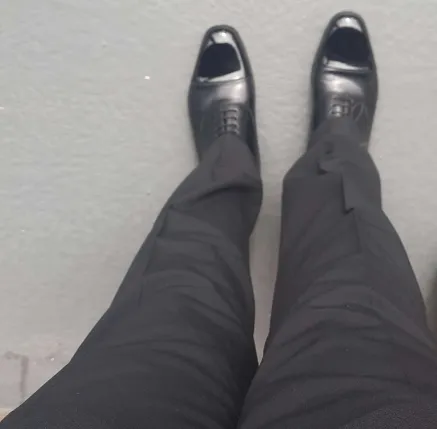

# How to polish shoes

Excuse trousers, first day of Year 12

### Important

I get it, no one likes a life story before a tutorial, skip this you may.

While serving in a youth cadet force, Ihad the shiniest shoes in the platoon, no one could hold a candle to me, I ended up polishing senior cadets shoes for money, especially before major events, so my opinion has some authority,

There are a lot of opinions on shoe polishing, hundreds out there, but I am old- 19, and do not care for them.

do not polish where creases are

good polish lasts years! however, hydration, 

why i dont like polish shoes, if you are boarding a train, incase you drop your shoes 
# Equipment

I dont like patent leather, looks cheap and tacky

Shined shoes are indeed beautiful but are they worth the headache you decide?

*Polish*: 
- Cheap shoes, Kiwi
- Expensive shoes, Saphir

Cloth, pure cotton t-shirt,
Or jeweller sylvet

Do not use that stupid yellow rag with red stitching,
